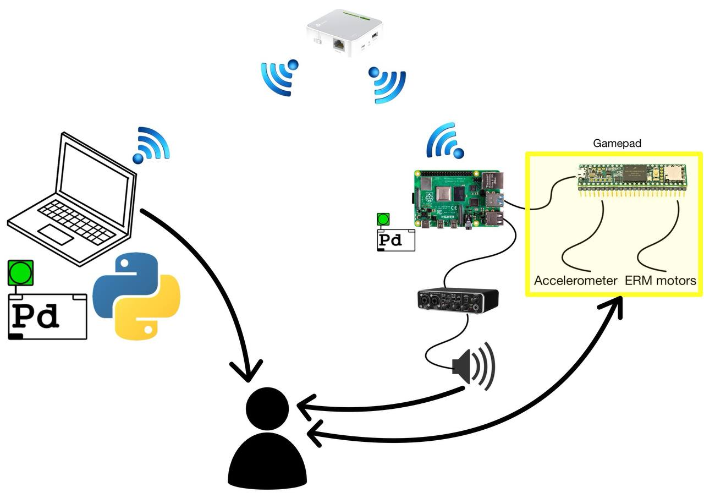
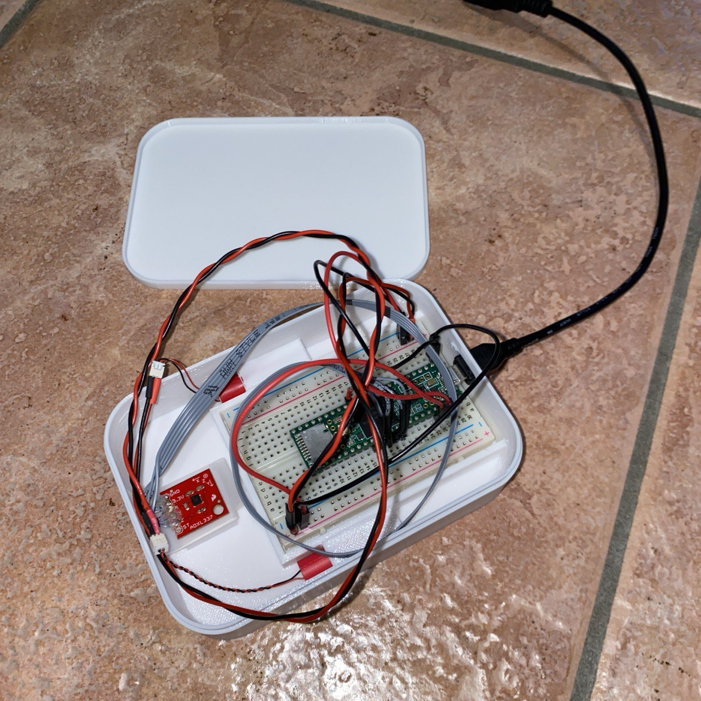
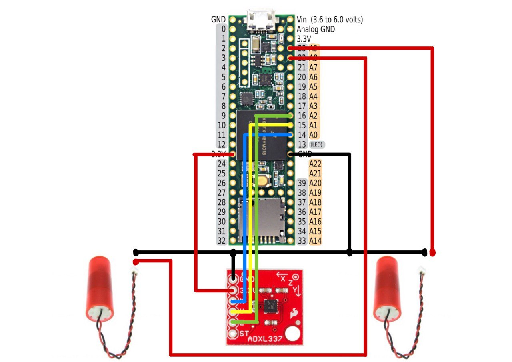
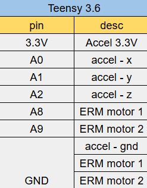

# MazeTilt
This project was developed as part of the Multisensory Interactive Systems course at the University of Trento.  

## Implementation overview
The system implements a tilt-controlled 3D labyrinth game with visual, audio, and haptic feedback.
A Teensy-based controller acquires accelerometer data and communicates with the system via OSC.
The architecture is distributed, with a PC and a Raspberry Pi connected through a router.
Game logic and real-time rendering run on the PC, while audio output and hardware interfaces are handled by the Raspberry Pi.
Visual feedback is displayed on the PC, while audio and haptic feedback are delivered through devices connected to the Raspberry Pi.  
A more detailed explanation of the system is provided in the report document, together with a demonstration video.
<div align="center">
    
</div>

## Hardware 
Our hardware setup includes a router used to create a local network. Both the PC and the Raspberry Pi are connected to the router. The gamepad controller and the sound card with loudspeaker are directly connected to the Raspberry Pi.
The gamepad contains:
- A Teensy 3.6 microcontroller mounted on a breadboard
- An ADXL337 analog accelerometer used to measure tilt along multiple axes
- 2x ERM vibration motors providing vibrotactile feedback
The accelerometer continuously measures the orientation of the gamepad. These values are sent to the PC via OSC communication with Pure Data patch, where they are mapped to the virtual inclination of the labyrinth. The ERM motors are directly controlled by the microcontroller based on commands received from the PC.
<div align="center">
    
    
    
</div>

## Software
```
├── 📁 Pd_serial_communication_send_receive
│   ├── 📄 Main_Pd_serial_communication_send_receive.pd
│   ├── 📄 _format_serial_messages.pd
│   ├── 📄 serial_print-help.pd
│   └── 📄 serial_print.pd
├── 📁 PureDataAudio
│   └── 📄 audioPatch.pd
├── 📁 SUS calculator
│   ├── 📄 sus-input-data.csv
│   ├── 📄 sus-results.csv
│   ├── 🐍 sus.py
│   └── 🖼️ sus_results_breakdown.png
├── 📁 Teensy
│   └── 📁 gamepad
│       └── 📄 gamepad.ino
├── 📁 images
│   ├── 🖼️ gamepad.jpg
│   ├── 🖼️ net.jpg
│   ├── 🖼️ pinout.jpg
│   ├── 🖼️ res.png
│   └── 🖼️ teensy.png
├── 📁 results
│   ├── 📁 plot
│   │   ├── 🖼️ collisions.png
│   │   ├── 🖼️ completion_time.png
│   │   ├── 🖼️ composite_score.png
│   │   └── 🖼️ remaining_lives.png
│   ├── 🐍 analize_results.py
│   └── 📄 results.csv
├── ⚙️ .gitignore
├── 📝 README.md
├── 🐍 accelerometer.py
├── 🐍 ball.py
├── 🐍 levels.py
├── 🐍 maze.py
├── 🐍 maze_tilt.py
└── 📄 requirements.txt
```

 
- The Python app on PC renders the maze/ball with Pygame + OpenGL and updates gravity based on the controller’s tilt.
- The physical tilt of the gamepad tilts the virtual maze, moving the sphere under simulated gravity.
- A single Pure Data patch generates audio for rolling, bounces, falling into a hole, and victory events.
- A Pure Data patch read from serial and sends the accelerometer values to the PC via OSC
- Audio communication via OSC: low-latency messages for synthesis and events.
- Vibrotactile: intensity increases near holes; OSC commands → microcontroller drive the ERM motors.
- The main file is ```maze_tilt.py```. You can run it:
  - ```python maze_tilt.py``` -> only video feedback
  - ```python maze_tilt.py --audio``` -> video + audio feedback
  - ```python maze_tilt.py --audio --vibration``` -> video + audio + haptic feedback


## Communication Architecture
The system uses two communication channels:
- Serial communication between Pure Data patches and the microcontroller for accelerometer data and haptic commands
- OSC communication between the Python application and Pure Data patches for audio control and haptic commands


## How to run
- Assumptions: the gamepad is already assembled and fully functional (with the code of `Teensy/gamepad.ino`), and the current working directory is `MazeTilt`
- Connect the Raspberry Pi to the router via Wi-Fi.
- Connect the PC to the router via Wi-Fi.
- On the Raspberry Pi, run the following Pure Data patches:
  - Accelerometer & communication:  
    `Pd_serial_communication_send_receive/Main_Pd_serial_communication_send_receive.pd`
  - Audio synthesis:  
    `PureDataAudio/audioPatch.pd`
- Run the script `python maze_tilt.py` alone (for only visual feedback) or with the desidered modality parameters (`--audio` for audio, `--vibration` for vibration, or both)
- The visual interface will be displayed on the PC. The game is controlled using the gamepad connected to the Raspberry Pi:
  - Input:
    - gamepad → Raspberry Pi (accelerometer)
  - Output:
    - visual feedback → PC
    - audio feedback → Raspberry Pi (loudspeaker)
    - haptic feedback → Raspberry Pi (ERM motor of the gamepad)
    
NB: The system can also be run entirely on a single PC for convenience.
In this case, connect all devices (gamepad and sound card) directly to the PC, run the Pure Data patches locally (adapting the serial port), and execute `maze_tilt.py` using the localhost IP address (`127.0.0.1`).


## Results

The results are well explained in the Report document, here we put for convinience only the most significant findings:
<div align="center">
        
</div>

**Bold** : best result  
<u>Underlined</u> : second best result

## Authors:
- Cappellaro Nicola
- Zannoni Riccardo

